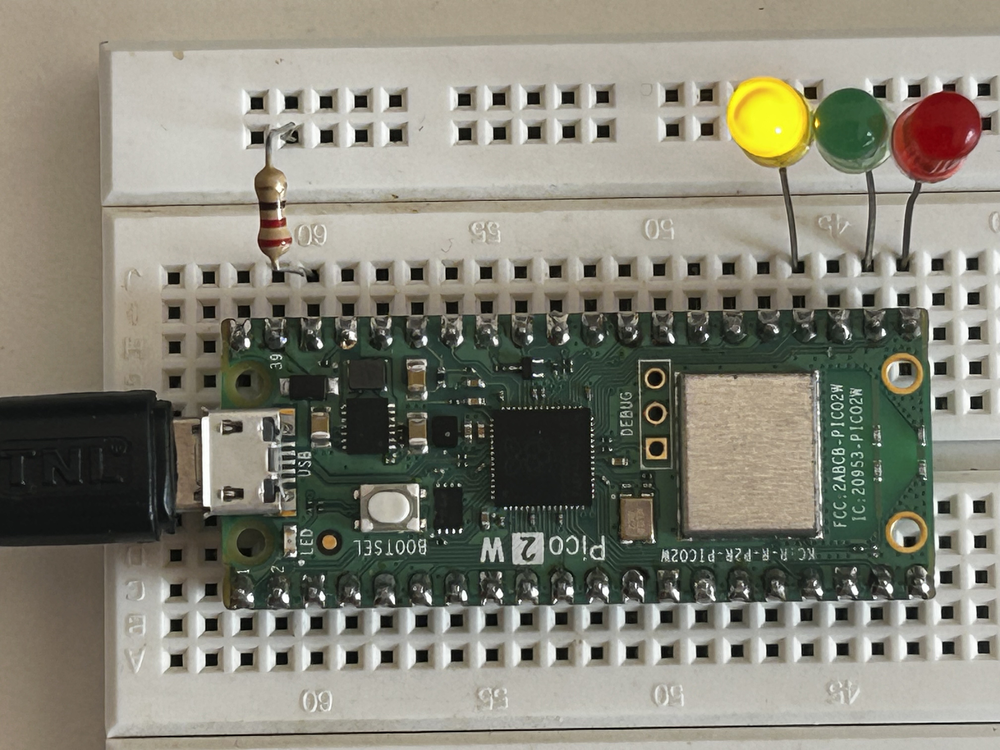

# Simple LED Chaser – Raspberry Pi Pico 2 W

A basic uni-directional LED chaser built using MicroPython on the Raspberry Pi Pico 2 W.
Three LEDs blink sequentially bi directionally, with a randomized delay to create a dynamic chaser effect.

## Hardware Required

* Raspberry Pi Pico 2 W
* 3 × LEDs
* 1 × 220–330Ω resistor
* Breadboard

The three LEDs are connected to three GPIO pins, can be any of your choice.

### Setup

